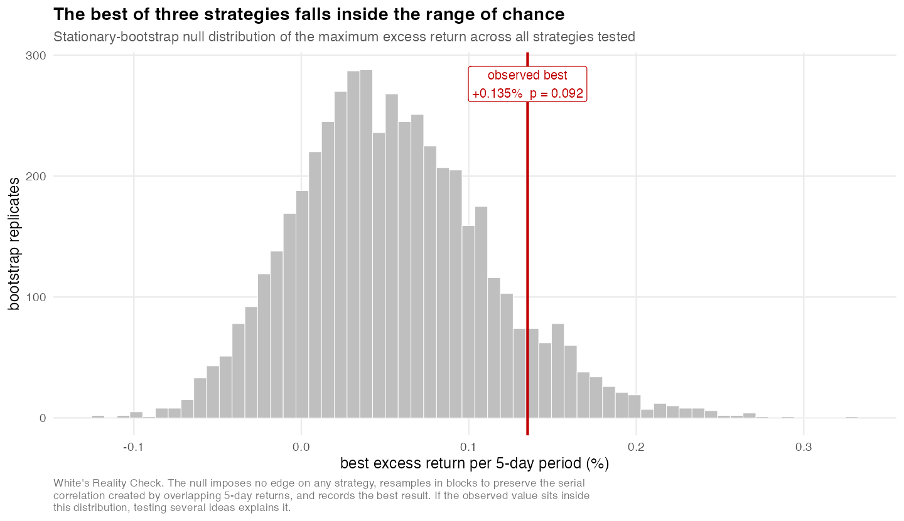

# Edge Audit

Backtests trading strategies, then audits whether the edge it found is real.

Most backtesting projects are built to find an edge. This one is built to check
the one you found, and it is willing to tell you no. It did tell me no.

**Python · SQL · R · Excel**

---

## The short version

I wanted to know if a short-term stock signal could actually make money. So I
pulled seven years of daily prices for 67 large caps, built 41 features, trained
models on past years and tested them on later ones, and traded the result on
paper with realistic costs.

It lost to buying the index, badly:

| | Strategy | Just buying SPY |
|---|---|---|
| Return over 7 years | **+15.3%** | **+204.4%** |
| Sharpe | 0.23 | 0.91 |
| Max drawdown | 17.1% | 33.7% |

That is the whole finding. Everything below is how I know it is not just bad luck
or a bug.

## Four reasons it was never going to work

**Costs took most of it.** The signal did find something: $6,078 of gross profit
on a $10k account. Slippage, spread and commission took $4,482 of that. And no,
a bigger account does not fix it. At $100k costs are still 63% of gross, at $1M
still 61%, because slippage is proportional. Only the fixed commission scales
away.

**My sample was five times smaller than it looked.** The model's best features
are market-wide, so its picks all pile onto the same few days. In the worst test
year, 1,342 picks landed on 52 dates, 41% of them on ten. Counting each row as a
separate trade made the Sharpe look like 1.59. Counting one return per day, which
is what actually happens to your account, it is 0.36.

**It fails the "how many things did you try" test.** Against a null of zero, the
model is significant at p = 0.009. But stocks drifted up over this period, so
zero is the wrong thing to beat. Against buy-and-hold, and correcting for the
fact that I tested 49 variants, p = 0.149. Nothing survives.

**The whole thing is balanced on a knife edge.** I rebuilt the project after
re-downloading the same data and net profit doubled. The data had moved by one
part in a million, vendor rounding on adjusted closes, with raw prices identical.
The model and backtest are both verified deterministic. A real edge does not flip
when the sixth decimal place changes.



## The part I am actually proud of

Anyone can run a backtest. The hard part is not fooling yourself, and that is
where most of this code went.

**A test that proves there is no lookahead.** `tests/test_no_lookahead.py` chops
the database off at an old date, rebuilds every feature from scratch, and checks
they come out byte-identical to the full-history version. Anything secretly
peeking at the future fails. It caught a real bug immediately: SQLite's `AVG`
was skipping a null and calling a 13-day average a 14-day ATR.

**A count of every strategy I ever tried.** Testing ideas until one looks good
guarantees one will look good. With 348 independent observations, the luckiest of
100 strategies with *zero* real edge posts a Sharpe around 0.96, which beats the
index. So `python/registry.py` logs every strategy before I run it, hypothesis
written down first, and abandoned attempts stay in the count forever. Then
`python/deflated_sharpe.py` tells me what a new candidate has to clear.

```
 trials   expected best from pure luck
      1                          0.000
     10                          0.599
     50                          0.866
    100                          0.963      <- SPY was 0.91
    500                          1.162
```

My own best sweep scored 0.830 against a bar of 0.863 at 49 trials. It fails its
own test, which is the point.

**Data I am not allowed to look at.** `python/lockbox.py` seals a date range the
search physically cannot read. Opening it is a one-way door, recorded with the
strategy it was opened for. Worth being honest here: every bar from 2014 to 2026
is already burned, because the backtest searched all of it. So the lockbox is
forward-dated and fills up as time passes. Slower, but it is the only version
that is actually clean.

**A forward test instead of a rerun.** Re-running the backtest monthly would just
be asking the same question over and over until it answered the way I wanted. So
the model is frozen with a SHA-256, and each month scores it on bars that did not
exist when it was frozen. Predictions get written down *before* outcomes exist,
into an append-only hash-chained ledger. `tests/test_ledger_integrity.py` proves
that editing a loss into a win, deleting a bad month, or reordering entries all
get caught.

| Stage | Trades | Effective obs | Excess vs SPY | p |
|---|---|---|---|---|
| holdout (2026 YTD) | 496 | 33.8 | +0.329% per 5 days | **0.452** |
| live (pre-registered) | 0 | — | — | — |

That holdout number looks healthy and means nothing. Its 95% interval runs from
-0.53% to +1.18%. The report prints the p-value next to the mean every time so
the number can never be read on its own.

## Running it

```bash
python3 build.py --from ingest     # whole pipeline, pinned data, no network
python3 python/forward_run.py      # the monthly forward test
python3 python/registry.py status  # what have I tried, and what is the bar now
python3 python/lockbox.py status   # what am I not allowed to look at
```

Every number in this README comes from the first command. The exact bars are
committed in `data/raw/bars_snapshot.csv.gz`, because the data vendor quietly
revises adjusted closes and a fresh download will not reproduce them. Use
`--ingest` when you want to check whether the finding survives new data.

## What is where

```
python/
  ingest_bars.py      downloads and checks bars, idempotent, quality issues stored as rows
  make_workbook.py    builds the Excel journal; validate_excel.py refuses bad rows
  model.py            baselines, logistic, gbm, with the clustering fix
  folds.py            walk-forward splits with a gap so no label leaks into the test year
  backtest.py         next-open fills, costs both sides, gross - costs = net asserted
  registry.py         every strategy ever tried, hash-chained
  deflated_sharpe.py  what a candidate has to beat, given how many you tried
  lockbox.py          data the search is not allowed to read
  freeze_model.py     pin a model with a hash; forward_run.py scores it monthly
sql/                  schema, features, labels, analysis views
R/                    stationary bootstrap, Reality Check, the five figures
tests/                lookahead audit, ledger integrity, search controls
```

## Honest limits

In `docs/LIMITATIONS.md`, but the short version: the universe is today's large
caps so it has survivorship bias, the data is daily so nothing intraday is
testable, and the cost model is an estimate rather than real fills.

## Not investment advice

This is a research exercise. It connects to no broker, places no orders, and its
main finding is that the strategy it studied does not work.
